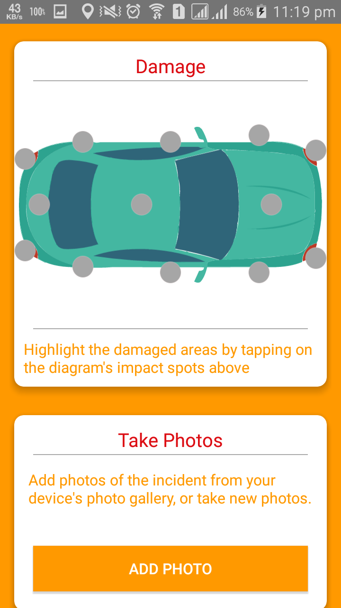

# MACH-Mobile-Auto-Insurance-Claim-Help-App
The application "MACH: Mobile Auto-Insurance Claim & Help System" describes the development of a real-time android based mobile application. This application contains features that one might need in case of emergency. This application automatically detects car accidents and sends a notification with the location of the vehicle crash to emergency contacts that one had previously selected. Allowing them to call rescue services in no time. This enormously reduces the rescue time increasing the survival chances and saving thousands of lives every year.

When in an emergency every second matters. That's why this application allows one to check nearby hospitals and other road side assistance like Fuel stations, Fire stations etc., with a single click, and even show the navigation route.

This application also provides the facility to report an incident on the go so if the unexpected does happen, the app is here to help people. After making a claim, a dedicated Claim's Manager will liaise with one's motor insurer, and third parties, and the approved repairer on one's behalf.

Following are some screenshots of the application implemented on smartphone side: 

Home Screen

Nearby Places

Insurance Claim

Accident Detection

User Profile with insurance Details

